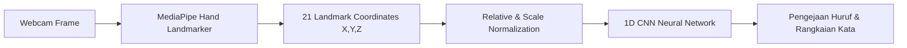

# 🤟 BISINDO Real-Time Sign Language Translator AI


Sistem Penerjemah Bahasa Isyarat Indonesia (**BISINDO**) Abjad (A-Z) secara **Real-Time** menggunakan kombinasi **MediaPipe Hand Landmarker**, **Relative & Scale Landmark Normalization**, dan **1D Convolutional Neural Network (CNN)**.

---

## 🌟 Fitur Utama

- ⚡ **Real-Time Detection (30-60 FPS):** Menjelaskan gestur abjad BISINDO secara instan melalui webcam tanpa lag.
- 🎯 **Relative & Scale Normalization:** Pengenalan gestur bebas dari posisi tangan di layar maupun jarak tangan ke kamera.
- 🔄 **Data Augmentation:** Model telah dilatih dengan rotasi acak ($\pm 15^\circ$) dan variasi noise agar tahan terhadap kemiringan tangan.
- 🌐 **Modern Web Interface:** Antarmuka web responsif menggunakan **Streamlit** dengan gaya desain modern & bersih.
- 💻 **Dual Execution Mode:** Mendukung eksekusi aplikasi web (Streamlit) maupun aplikasi desktop native (OpenCV).

---

## 🏗️ Arsitektur & Pipeline AI



1. **Feature Extraction:** MediaPipe mengekstrak 21 titik koordinat 3D $(x, y, z)$ dari tangan.
2. **Landmark Normalization:** Menggeser pusat koordinat ke pergelangan tangan (wrist / titik 0) dan membagi nilainya dengan skala maksimum agar selalu berada pada rentang $[-1.0, 1.0]$.
3. **Classification:** Model **1D CNN** memproses 63 fitur numerik ter-normalisasi dan menghasilkan estimasi huruf A-Z dengan tingkat kepercayaan (confidence score).
4. **Word Assembly Engine:** Logika penahan (thresholding) mencatat huruf menjadi kata utuh secara otomatis saat posisi tangan stabil selama $\approx 0.5$ detik.

---

## 📁 Struktur Direktori Proyek

```text
bisindo-realtime/
├── app_streamlit.py           # Aplikasi Web Real-Time (Streamlit)
├── app.py                     # Aplikasi Desktop Native (OpenCV)
├── train_model.py             # Script Pelatihan Model CNN dengan Data Augmentasi
├── script_ekstraksi_bisindo.py# Script Ekstraksi Feature Landmark dari Dataset Gambar
├── model_bisindo.ipynb        # Jupyter Notebook untuk Eksperimen & Analisis Model
├── cnn_bisindo.h5             # Model CNN Terlatih
├── classes_bisindo.npy        # File Label Kelas Abjad (A-Z)
├── hand_landmarker.task       # Model MediaPipe Hand Landmarker Task
├── train_landmarks.csv        # Dataset Feature Landmark Latih (Normalized)
├── val_landmarks.csv          # Dataset Feature Landmark Validasi (Normalized)
├── requirements.txt           # Daftar Dependensi Pustaka Python
└── README.md                  # Dokumentasi Proyek
```

---

## 🚀 Panduan Instalasi & Penggunaan

### 1. Clone Repository & Install Dependensi
```bash
# Clone repository ini
git clone https://github.com/faiqmisbah/bisindo-realtime.git
cd bisindo-realtime

# Install seluruh dependensi pustaka
pip install -r requirements.txt
```

### 2. Jalankan Aplikasi Web (Streamlit)
```bash
streamlit run app_streamlit.py
```
Akses aplikasi melalui browser di `http://localhost:8501`.

### 3. (Opsional) Jalankan Aplikasi Desktop (OpenCV Native)
```bash
python app.py
```

---

## 🧠 Melatih Ulang Model (Re-training)

Jika ingin melatih ulang model CNN menggunakan dataset terbaru:

```bash
# 1. Jalankan ekstraksi landmark (jika ada gambar dataset baru)
python script_ekstraksi_bisindo.py

# 2. Jalankan training model CNN dengan Data Augmentation
python train_model.py
```

---

## 👤 Pengembang

**Faiq Misbah Yazdi**  
- **Website:** [faiqmisbah.github.io/portfolio-faiq](https://faiqmisbah.github.io/portfolio-faiq/)  
- **GitHub:** [@faiqmisbah](https://github.com/faiqmisbah)

---

## 📜 Lisensi

Proyek ini dilindungi di bawah lisensi [MIT License](LICENSE).
